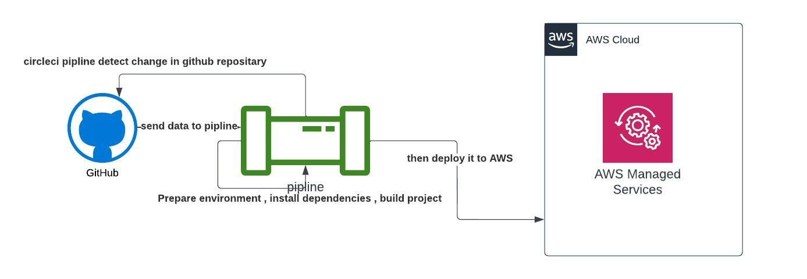

### Pipeline process
```
- Spine up environments

- Perepare environments variables

- Install Node.jS

- Check out code

- Install Front-End dependency 

- Install Back-End `api` dependency

- Build Front-End

- Build Back-End `api`

- deploy

```


